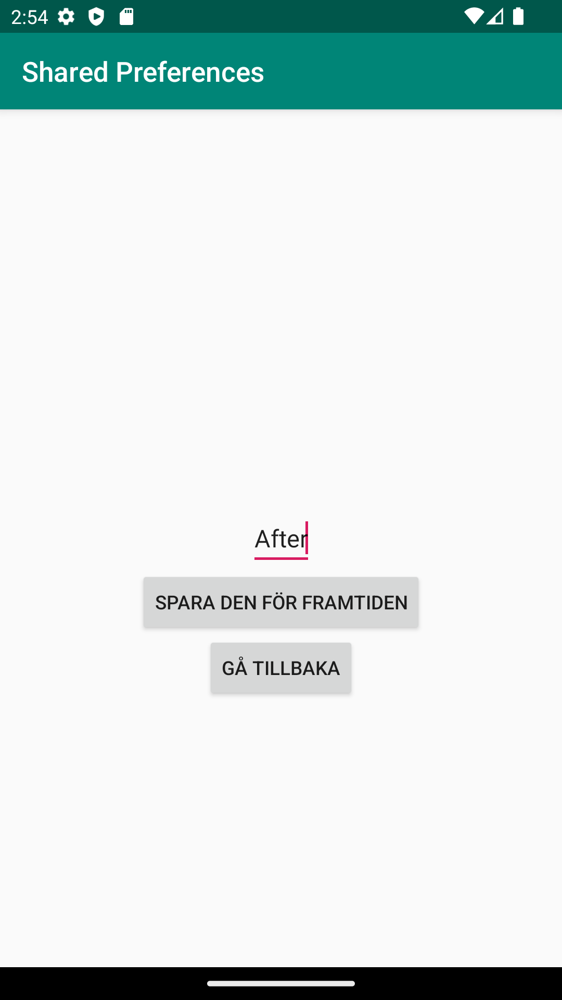

# Rapport

**Skriv din rapport här!**
Jag gjorde en ny activity som jag döpte till SecondActivity.java samt en ny screen som jag döpte till
activity_second.xml enligt uppgiftsbeskrivningen. Sedan gjorde jag så att det gick att skriva in sin
preference i en edit text view och spara den i den andra activityn som sedan visar upp det man skrivit i main activityn.
```
...
protected void onCreate(Bundle savedInstanceState) {
        super.onCreate(savedInstanceState);
        setContentView(R.layout.activity_second);

        namn = findViewById(R.id.redigera);
        button = findViewById(R.id.spara);
        preferences = getSharedPreferences("preferences", MODE_PRIVATE);
        tillbaka = findViewById(R.id.tillbaka);
        tillbaka.setOnClickListener(new View.OnClickListener() {
            @Override
            public void onClick(View v) {
                finish();
            }
        });

        button.setOnClickListener(new View.OnClickListener() {
            @Override
            public void onClick(View v) {
                SharedPreferences.Editor editor = preferences.edit();
                editor.putString("name", namn.getText().toString());
                editor.apply();
            }
        });
    }
...
```
Jag gjorde också så att main activity kan ta emot denna data så att inte second activity bara
skickar data som inte används till någonting. Den datan som tas emot från second activityn sparas även
till nästa gång man öppnar appen.
```
...
protected void onCreate(Bundle savedInstanceState) {
        super.onCreate(savedInstanceState);
        setContentView(R.layout.activity_main);
        Toolbar toolbar = findViewById(R.id.toolbar);
        setSupportActionBar(toolbar);

        text = findViewById(R.id.text);
        preferences = getSharedPreferences("preferences", MODE_PRIVATE);
        button = findViewById(R.id.klick);
        button.setOnClickListener(new View.OnClickListener() {
            @Override
            public void onClick(View v) {
                Intent intent = new Intent(MainActivity.this, SecondActivity.class);
                startActivity(intent);
            }
        });

    }

    @Override
    protected void onResume() {
        super.onResume();
        String name = preferences.getString("name", "inget namn hittades");
        text.setText(name);
    }
...
```


before

after 1

after 2
